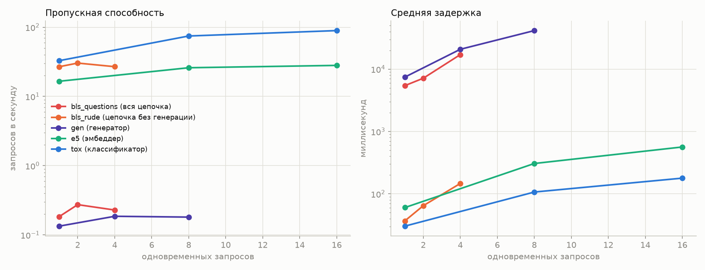
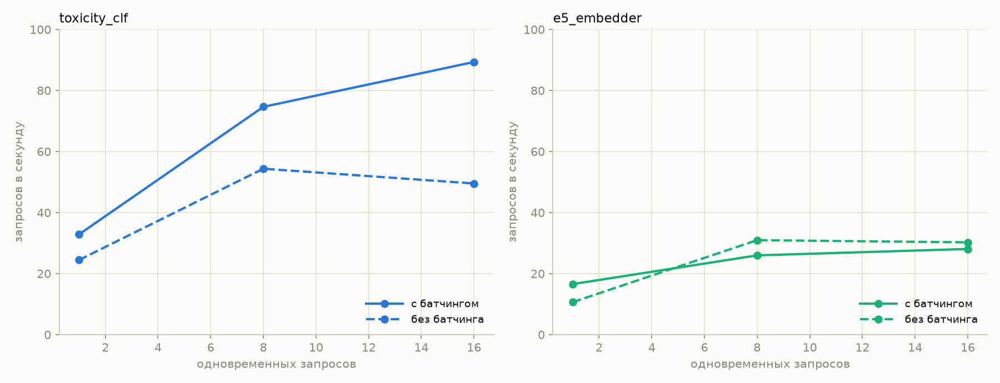
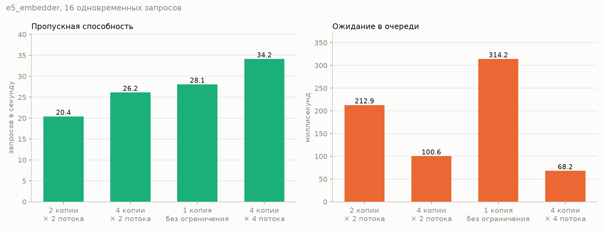

# Отчёт: оркестрация моделей в Triton

## 1. Дерево Model Repository

```
model_repository
├── assistant_bls
│   ├── 1
│   │   ├── corpus
│   │   │   ├── documents.json
│   │   │   └── vectors.npy
│   │   ├── tokenizers
│   │   │   ├── e5
│   │   │   │   ├── sentencepiece.bpe.model
│   │   │   │   ├── special_tokens_map.json
│   │   │   │   ├── tokenizer.json
│   │   │   │   └── tokenizer_config.json
│   │   │   ├── qwen
│   │   │   │   ├── added_tokens.json
│   │   │   │   ├── merges.txt
│   │   │   │   ├── special_tokens_map.json
│   │   │   │   ├── tokenizer.json
│   │   │   │   ├── tokenizer_config.json
│   │   │   │   └── vocab.json
│   │   │   └── ru
│   │   │       ├── special_tokens_map.json
│   │   │       ├── tokenizer.json
│   │   │       ├── tokenizer_config.json
│   │   │       └── vocab.txt
│   │   ├── bls_prompt.py
│   │   └── model.py
│   └── config.pbtxt
├── e5_embedder
│   ├── 1
│   │   └── model.onnx
│   └── config.pbtxt
├── text_generator
│   ├── 1
│   │   └── model.json
│   └── config.pbtxt
└── toxicity_clf
    ├── 1
    │   └── model.onnx
    └── config.pbtxt
```

## 2. Конфигурация моделей

### `assistant_bls/config.pbtxt`

```protobuf
name: "assistant_bls"
backend: "python"
max_batch_size: 0

input [
  { name: "TEXT", data_type: TYPE_STRING, dims: [ 1 ] }
]

output [
  { name: "ANSWER", data_type: TYPE_STRING, dims: [ 1 ] },
  { name: "ROUTE",  data_type: TYPE_STRING, dims: [ 1 ] },
  { name: "DOCS",   data_type: TYPE_STRING, dims: [ 1 ] }
]

instance_group [ { count: 2, kind: KIND_CPU } ]
```

### `e5_embedder/config.pbtxt`

```protobuf
name: "e5_embedder"
backend: "onnxruntime"
max_batch_size: 8

input [
  { name: "input_ids",      data_type: TYPE_INT64, dims: [ 128 ] },
  { name: "attention_mask", data_type: TYPE_INT64, dims: [ 128 ] }
]

output [
  { name: "sentence_embedding", data_type: TYPE_FP32, dims: [ 384 ] }
]

dynamic_batching {
  preferred_batch_size: [ 4, 8 ]
  max_queue_delay_microseconds: 3000
}

instance_group [ { count: 4, kind: KIND_CPU } ]
parameters {
  key: "intra_op_thread_count"
  value: { string_value: "2" }
}
```

### `text_generator/config.pbtxt`

```protobuf
name: "text_generator"
backend: "vllm"

instance_group [ { count: 1, kind: KIND_MODEL } ]
```

### `toxicity_clf/config.pbtxt`

```protobuf
name: "toxicity_clf"
backend: "onnxruntime"
max_batch_size: 8

input [
  { name: "input_ids",      data_type: TYPE_INT64, dims: [ 128 ] },
  { name: "attention_mask", data_type: TYPE_INT64, dims: [ 128 ] },
  { name: "token_type_ids", data_type: TYPE_INT64, dims: [ 128 ] }
]

output [
  { name: "logits", data_type: TYPE_FP32, dims: [ 5 ] }
]

dynamic_batching {
  preferred_batch_size: [ 4, 8 ]
  max_queue_delay_microseconds: 3000
}

instance_group [ { count: 2, kind: KIND_CPU } ]
```

`instance_group { count: N }` в конфигах выше — сколько экземпляров модели
Triton держит в памяти. Каждый экземпляр берёт по одному запросу за раз,
остальные ждут в очереди. Дальше в отчёте они называются копиями.

Код BLS — [`model_repository/assistant_bls/1/model.py`](../model_repository/assistant_bls/1/model.py),
сборка промпта — [`bls_prompt.py`](../model_repository/assistant_bls/1/bls_prompt.py).

## 3. Все модели READY

```
Модели в репозитории:
   ✅ ready  assistant_bls
   ✅ ready  e5_embedder
   ✅ ready  text_generator
   ✅ ready  toxicity_clf
```

## 4. Замеры

| scenario | Concurrency | RPS | avg latency | p95 | Queue | Compute Input | Compute Infer | Compute Output |
|:---|---:|---:|---:|---:|---:|---:|---:|---:|
| bls_questions | 1 | 0.18 | 5431.90 | 8827.22 | 0.16 | 0.06 | 5427.53 | 0.47 |
| bls_questions | 2 | 0.27 | 7145.66 | 12619.14 | 0.15 | 0.07 | 7141.01 | 0.50 |
| bls_questions | 4 | 0.23 | 17093.52 | 35130.47 | 8419.46 | 0.11 | 8669.87 | 0.51 |
| bls_rude | 1 | 26.87 | 36.83 | 53.10 | 0.92 | 0.07 | 30.54 | 0.46 |
| bls_rude | 2 | 30.34 | 64.62 | 116.66 | 1.03 | 0.07 | 55.56 | 0.51 |
| bls_rude | 4 | 26.91 | 146.83 | 235.17 | 61.26 | 0.07 | 72.61 | 0.88 |
| e5 | 1 | 16.57 | 60.24 | 84.41 | 3.36 | 0.07 | 51.74 | 0.04 |
| e5 | 8 | 25.97 | 306.71 | 469.38 | 132.25 | 0.29 | 165.85 | 0.06 |
| e5 | 16 | 28.08 | 564.48 | 788.27 | 304.40 | 0.33 | 249.55 | 0.07 |
| e5_count1 | 16 | 28.08 | 567.21 | 819.74 | 314.22 | 0.24 | 241.57 | 0.08 |
| e5_count2 | 16 | 20.42 | 779.28 | 1137.77 | 212.95 | 0.09 | 559.21 | 0.07 |
| e5_count4x2 | 16 | 26.16 | 603.59 | 942.71 | 100.58 | 0.21 | 493.27 | 0.09 |
| e5_count4x4 | 16 | 34.16 | 463.21 | 719.47 | 68.22 | 0.13 | 382.50 | 0.09 |
| e5_nobatch | 1 | 10.66 | 93.70 | 108.59 | 0.16 | 0.04 | 88.73 | 0.04 |
| e5_nobatch | 8 | 30.96 | 256.57 | 289.10 | 122.08 | 0.04 | 128.06 | 0.05 |
| e5_nobatch | 16 | 30.25 | 522.05 | 588.16 | 384.17 | 0.05 | 131.31 | 0.05 |
| gen | 1 | 0.13 | 7442.20 | 11129.01 | 0.15 | 0.13 | 1.36 | 0.06 |
| gen | 4 | 0.19 | 20798.79 | 39598.18 | 0.26 | 0.10 | 0.93 | 0.06 |
| gen | 8 | 0.18 | 41466.08 | 76126.58 | 0.33 | 0.10 | 1.07 | 0.06 |
| tox | 1 | 32.86 | 30.36 | 52.01 | 3.54 | 0.06 | 20.97 | 0.04 |
| tox | 8 | 74.64 | 106.95 | 186.34 | 25.62 | 0.16 | 72.62 | 0.05 |
| tox | 16 | 89.33 | 178.68 | 288.69 | 48.88 | 0.23 | 118.51 | 0.11 |
| tox_nobatch | 1 | 24.47 | 40.82 | 67.12 | 1.19 | 0.06 | 33.06 | 0.04 |
| tox_nobatch | 8 | 54.36 | 147.09 | 210.25 | 105.17 | 0.07 | 35.16 | 0.06 |
| tox_nobatch | 16 | 49.52 | 320.08 | 458.32 | 272.85 | 0.08 | 38.37 | 0.05 |

Расшифровка:

- `bls_questions` — вся цепочка целиком, вход в `assistant_bls`: три обычных
  вопроса про КМВ. Проходят классификатор, идут в поиск и в генератор.
  Запросы — [`bench/bls_questions.json`](../bench/bls_questions.json).
- `bls_rude` — та же цепочка, но два грубых запроса. Классификатор ловит
  токсичность, BLS возвращает отказ, генератор не вызывается.
  [`bench/bls_rude.json`](../bench/bls_rude.json).
- `e5` — `e5_embedder` напрямую, минуя BLS. Готовые `input_ids` и
  `attention_mask`, конфиг как в репозитории: батчинг включён, 4 копии
  по 2 потока.
- `e5_count1`, `e5_count2`, `e5_count4x2`, `e5_count4x4` — тот же эмбеддер
  при concurrency 16 с разным `instance_group`: 1 копия без ограничения
  по потокам, 2 копии по 2 потока, 4 копии по 2 потока, 4 копии по 4 потока.
  Подбор числа копий, раздел 9.
- `e5_nobatch` — эмбеддер с вырезанным блоком `dynamic_batching`,
  всё остальное как в `e5`. Сравнение в разделе 5.
- `gen` — `text_generator` напрямую, готовый промпт с уже подставленными
  документами. Без классификатора и поиска, чистое время генерации.
- `tox` — `toxicity_clf` напрямую, конфиг из репозитория с батчингом.
- `tox_nobatch` — он же без `dynamic_batching`.

Все задержки в миллисекундах, `avg latency` — сумма всех этапов, от отправки
клиентом до получения ответа. 

Этапы:
- `Queue` — ожидание в очереди, 
- `Compute Input` — подготовка входных тензоров,
- `Compute Infer` — счёт модели, 
- `Compute Output` — сборка ответа. 

В строке `gen` сумма стадий не сходится с общим временем:
0.16 + 0.13 + 1.36 + 0.06 = 1.7 мс против 7442 мс в `avg latency`.
У остальных моделей сходится (`tox` при c1: 24.6 против 30.4). Причина: 
Triton останавливает счётчик, когда модель отдала ответ, а vLLM
отдаёт его сразу и досылает текст потом, по токенам — генерация в счётчик
не попадает. Поэтому строки `gen` надо смотреть по `RPS` и `avg latency`:
0.13 запроса в секунду, 7.4 секунды на ответ.



На графике пять сценариев: вся цепочка (`bls_questions`), цепочка без генерации
(`bls_rude`) и три модели по отдельности. Шкала логарифмическая — иначе
генератор и классификатор не помещаются на одну картинку. Видно две группы:
всё, что идёт через генератор, лежит ниже 0.3 запроса в секунду, всё
остальное — выше 15. 

## 5. Батчинг и без него

Сценарии `*_nobatch` — те же модели с вырезанным блоком `dynamic_batching`.
Пропускная способность, запросов в секунду:

| Модель | c1 | c8 | c16 |
|---|---|---|---|
| `toxicity_clf` с батчингом | 32.9 | 74.6 | **89.3** |
| `toxicity_clf` без батчинга | 24.5 | 54.4 | 49.5 |
| `e5_embedder` с батчингом | 16.6 | 26.0 | 28.1 |
| `e5_embedder` без батчинга | 10.7 | **31.0** | **30.3** |

Классификатору батчинг помогает: на 16 одновременных запросах 89.3 против 49.5,
рост в 1.8 раза. Модель лёгкая, пачка из четырёх-восьми запросов набирается
быстрее, чем истекает `max_queue_delay_microseconds: 3000`.

Эмбеддеру не помогает, а мешает: на 8 и 16 без батчинга даже быстрее. Он
тяжелее, времени на набор пачки не хватает, и запрос просто отлёживает свои
3 мс впустую.



**Внутри цепочки батчинг бесполезен.** BLS вызывает
модели по одному запросу за раз, набирать пачку не из чего, и каждый вызов
`toxicity_clf` внутри цепочки платит те же 3 мс ожидания.

## 6. Загрузка железа

`nvidia-smi` в покое и под нагрузкой генератора:
[`raw/nvidia_smi_idle.txt`](raw/nvidia_smi_idle.txt),
[`raw/nvidia_smi_gen_load.txt`](raw/nvidia_smi_gen_load.txt).
Метрики Triton с порта 8002: [`raw/metrics_gen_load.txt`](raw/metrics_gen_load.txt),
смотреть `nv_inference_request_duration_us` и `nv_inference_queue_duration_us`
по каждой модели.

| Состояние | Видеопамять | GPU-Util | Питание | Температура |
|---|---|---|---|---|
| покой | 2403 / 4096 МиБ | 0% | 1 Вт | 48 °C |
| нагрузка генератора | 2433 / 4096 МиБ | 100% | 26 Вт | 62 °C |

Видеопамять под нагрузкой почти не растёт: vLLM резервирует её при старте
и держит независимо от числа запросов. Меняется только утилизация — с нуля
до сотни.

## 7. Узкое место

Обе ветки идут через одну и ту же BLS и один и тот же классификатор.
Разница только в том, доходит ли запрос до генератора.

| Ветка | RPS при c1 | Задержка |
|---|---|---|
| `bls_questions`: классификатор + поиск + генерация | 0.18 | 5432 мс |
| `bls_rude`: классификатор + отказ | 26.87 | 37 мс |

Разрыв в 150 раз. Генератор съедает 99.3% времени ответа, всё остальное —
0.7%. Значит оптимизировать классификатор или поиск бессмысленно: даже
ускорив их вдвое, мы выиграем доли процента:

`tox` выдаёт 89 RPS, `e5` — 28, `gen` — 0.13. Два порядка разницы.

Второе узкое место — число копий BLS. Строка `bls_questions`:

| Одновременных запросов | Queue | Compute Infer |
|---:|---:|---:|
| 1 | 0.16 | 5428 |
| 2 | 0.15 | 7141 |
| 4 | **8419** | 8670 |

На одном и двух запросах очередь нулевая — копий BLS две, оба запроса
обслуживаются сразу. На четырёх третий и четвёртый ждут, пока освободится
копия: 8419 мс запрос просто стоит, ещё 8670 мс считается. Половина времени
ответа уходит впустую.

## 8. Чем Triton лучше FastAPI

- промежуточные тензоры не сериализуются и не ходят по сети: BLS вызывает
  модели внутри сервера
- батчинг настраивается конфигом, а не пишется руками
- число копий модели меняется строкой `instance_group`, без правки кода
- метрики по каждой модели отдельно есть из коробки, порт 8002

## 9. Предложения по оптимизации

**1. У эмбеддера держать 4 копии, а не одну.** Замер при concurrency 16:

| Конфигурация | Занято ядер | RPS | Очередь |
|---|---:|---:|---:|
| 2 копии × 2 потока | 4 | 20.4 | 213 мс |
| 4 копии × 2 потока | 8 | 26.2 | 101 мс |
| 1 копия без ограничения | 16 | 28.1 | 314 мс |
| 4 копии × 4 потока | 16 | **34.2** | **68 мс** |



Прирост 22% и очередь короче вчетверо.

Числа выстраиваются по числу ядер, отданных модели. `intra_op_thread_count`
задаёт, сколько ядер берёт одна копия: 2 копии × 2 потока — это 4 ядра,
4 × 2 — восемь, 4 × 4 — все шестнадцать. 

Одна копия ограничения не имела и занимала все ядра сама, но дала только
28.1. Ядер у неё столько же, сколько у варианта 4 × 4, — разница в том, что
одна копия кидает все 16 ядер на один запрос и берёт следующий только после
него, а четыре копии считают четыре запроса разом, по 4 ядра на каждый - это получается выгоднее.

В конфиге при этом оставлено 4 копии × 2 потока, а не лучший по замеру
вариант 4×4. Причина: 4×4 занимает все 16 ядер, а в цепочке на тех же ядрах
работают классификатор и две копии BLS с токенизацией. Замер 4×4 снимался
при нагрузке на эмбеддер в одиночку, и в цепочке этот результат не повторится.

**2. Батчинг выключить у эмбеддера, оставить у классификатора.** Батчинг
заставляет Triton придержать запрос до 3 мс (`max_queue_delay_microseconds:
3000`), чтобы набрать пачку и посчитать её за один проход. Классификатору
это окупается: он лёгкий, пачка набирается быстро — 89.3 запроса в секунду
против 49.5 без батчинга (на 16 одновременных). Эмбеддер тяжелее, за 3 мс
набрать пачку не успевает, и запрос отлёживает задержку впустую — 28.1
с батчингом против 30.3 без.

**3. Копий BLS сделать больше двух.** Сейчас их две: на четырёх запросах два лишних ждут в очереди столько же, сколько потом считаются.

**4. Экономить вызовы генератора, а не ускорять модели.** Из раздела 7: путь
без генерации в 150 раз дешевле. Кэш ответов на частые вопросы или более
жёсткий отсев дадут больше, чем любая оптимизация ONNX-моделей.

**5. Переменная длина вместо фиксированных 128 токенов.** Сейчас короткий
вопрос считается как длинный: padding до 128 в обеих ONNX-моделях.

## 10. Сырые логи

Все прогоны Perf Analyzer: [`raw/`](raw/), сводка: [`summary.csv`](summary.csv).
